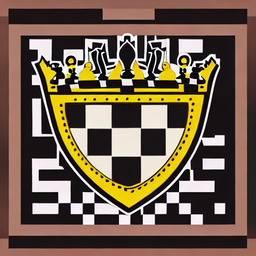

<!-- Improved compatibility of back to top link: See: https://github.com/othneildrew/Best-README-Template/pull/73 -->
<a name="readme-top"></a>
<!--
*** Thanks for checking out the Best-README-Template. If you have a suggestion
*** that would make this better, please fork the repo and create a pull request
*** or simply open an issue with the tag "enhancement".
*** Don't forget to give the project a star!
*** Thanks again! Now go create something AMAZING! :D
-->

<!-- PROJECT SHIELDS -->
<!--
*** I'm using markdown "reference style" links for readability.
*** Reference links are enclosed in brackets [ ] instead of parentheses ( ).
*** See the bottom of this document for the declaration of the reference variables
*** for contributors-url, forks-url, etc. This is an optional, concise syntax you may use.
*** https://www.markdownguide.org/basic-syntax/#reference-style-links
-->
<!-- [![Contributors][contributors-shield]][contributors-url]
[![Forks][forks-shield]][forks-url]
[![Stargazers][stars-shield]][stars-url]
[![Issues][issues-shield]][issues-url]
[![MIT License][license-shield]][license-url]
[![LinkedIn][linkedin-shield]][linkedin-url] -->

<div align="center">

  <a href="https://github.com/colding10/CXX-Chess">
    
  </a>

  [![Contributors][contributors-shield]][contributors-url]
  [!Forks][forks-shield]][forks-url]
  [![Stargazers][stars-shield]][stars-url]
  [![Issues][issues-shield]][issues-url]
  [![MIT License][license-shield]][license-url]
  [![LinkedIn][linkedin-shield]][linkedin-url]

</div>

<!-- PROJECT LOGO -->
<br />
<div align="center">
  
<h3 align="center">Kingfish</h3>

  <p align="center">
    A C++ implementation of a playable chess game. This turned into my own chess engine that I am continuously improving.
    <br />
    <a href="https://github.com/colding10/CXX-Chess"><strong>Explore the docs »</strong></a>
    <br />
    <br />
    <a href="https://github.com/colding10/CXX-Chess">View Demo</a>
    ·
    <a href="https://github.com/colding10/CXX-Chess/issues">Report Bug</a>
    ·
    <a href="https://github.com/colding10/CXX-Chess/issues">Request Feature</a>
  </p>
</div>

<!-- TABLE OF CONTENTS -->
<details>
  <summary>Table of Contents</summary>
  <ol>
    <li>
      <a href="#about-the-project">About The Project</a>
      <ul>
        <li><a href="#built-with">Built With</a></li>
      </ul>
    </li>
    <li>
      <a href="#getting-started">Getting Started</a>
      <ul>
        <li><a href="#prerequisites">Prerequisites</a></li>
        <li><a href="#installation">Installation</a></li>
      </ul>
    </li>
    <li><a href="#usage">Usage</a></li>
    <li><a href="#roadmap">Roadmap</a></li>
    <li><a href="#contributing">Contributing</a></li>
    <li><a href="#license">License</a></li>
    <li><a href="#contact">Contact</a></li>
    <li><a href="#acknowledgments">Acknowledgments</a></li>
  </ol>
</details>

<!-- ABOUT THE PROJECT -->
## About The Project

[![Product Name Screen Shot][product-screenshot]](https://example.com)

<p align="right">(<a href="#readme-top">back to top</a>)</p>

### Built With

* [![C++][C++]][C++-url]
* [![SDL2][SDL2]][SDL-url]

<p align="right">(<a href="#readme-top">back to top</a>)</p>

<!-- GETTING STARTED -->
## Getting Started

This is an example of how you may give instructions on setting up your project locally.
To get a local copy up and running follow these simple example steps.

### Prerequisites

This installation assumes MacOS X 10.14. Support for other operating systems or versions is not tested.

* Homebrew (if not installed)

  ```bash
  /bin/bash -c "$(curl -fsSL https://raw.githubusercontent.com/Homebrew/install/HEAD/install.sh)"
  ```

* SDL2

  ```bash
  brew install SDL2
  ```

* SDL2_image
  
  ```bash
  brew install SDL2_image
  ```

* SDL2_ttf

  ```bash
  brew install SDL2_ttf
  ```

### Installation

1. Clone the repo

   ```sh
   git clone https://github.com/colding10/CXX-Chess.git
   ```

2. Install NPM packages

   ```sh
   npm install
   ```

<p align="right">(<a href="#readme-top">back to top</a>)</p>

<!-- USAGE EXAMPLES -->
## Usage

Use this space to show useful examples of how a project can be used. Additional screenshots, code examples and demos work well in this space. You may also link to more resources.

_For more examples, please refer to the [Documentation](https://example.com)_

<p align="right">(<a href="#readme-top">back to top</a>)</p>

<!-- ROADMAP -->
## Roadmap

* [x] Complete negamax implementation solidly
* [x] Complete basic GUI and features
* [ ] Add improvements until bot can consistently beat me (ELO ~1000-1200)
  * [x] Alpha-Beta pruning
  * [ ] Iterative deepening
  * [x] Transposition table
  * [ ] Quiescence search
* [ ] Complete GUI and features (make feature rich, nice UX)
* [ ] Convert program (GUI) into library (while still maintaining interface)
* [ ] Implement engine interfaces (UCI) and advanced improvements
* [ ] Play engine against other programs to rank ELO

See the [open issues](https://github.com/colding10/CXX-Chess/issues) for a full list of proposed features (and known issues).

<p align="right">(<a href="#readme-top">back to top</a>)</p>

<!-- CONTRIBUTING -->
## Contributing

Contributions are what make the open source community such an amazing place to learn, inspire, and create. Any contributions you make are **greatly appreciated**.

If you have a suggestion that would make this better, please fork the repo and create a pull request. You can also simply open an issue with the tag "enhancement".
Don't forget to give the project a star! Thanks again!

1. Fork the Project
2. Create your Feature Branch (`git checkout -b feature/AmazingFeature`)
3. Commit your Changes (`git commit -m 'Add some AmazingFeature'`)
4. Push to the Branch (`git push origin feature/AmazingFeature`)
5. Open a Pull Request

<p align="right">(<a href="#readme-top">back to top</a>)</p>

<!-- LICENSE -->
## License

Distributed under the MIT License. See `LICENSE.txt` for more information.

<p align="right">(<a href="#readme-top">back to top</a>)</p>

<!-- CONTACT -->
## Contact

Colin Ding - [@twitter_handle](https://twitter.com/twitter_handle) - colinding10@gmail.com

Project Link: [https://github.com/colding10/CXX-Chess](https://github.com/colding10/CXX-Chess)

<p align="right">(<a href="#readme-top">back to top</a>)</p>

<!-- ACKNOWLEDGMENTS -->
## Acknowledgments

* []()
* []()
* []()

<p align="right">(<a href="#readme-top">back to top</a>)</p>

<!-- MARKDOWN LINKS & IMAGES -->
<!-- https://www.markdownguide.org/basic-syntax/#reference-style-links -->
[contributors-shield]: https://img.shields.io/github/contributors/colding10/CXX-Chess.svg?style=for-the-badge
[contributors-url]: https://github.com/colding10/CXX-Chess/graphs/contributors

[forks-shield]: https://img.shields.io/github/forks/colding10/CXX-Chess.svg?style=for-the-badge
[forks-url]: https://github.com/colding10/CXX-Chess/network/members

[stars-shield]: https://img.shields.io/github/stars/colding10/CXX-Chess.svg?style=for-the-badge
[stars-url]: https://github.com/colding10/CXX-Chess/stargazers

[issues-shield]: https://img.shields.io/github/issues/colding10/CXX-Chess.svg?style=for-the-badge
[issues-url]: https://github.com/colding10/CXX-Chess/issues

[license-shield]: https://img.shields.io/github/license/colding10/CXX-Chess.svg?style=for-the-badge
[license-url]: https://github.com/colding10/CXX-Chess/blob/master/LICENSE.txt

[linkedin-shield]: https://img.shields.io/badge/-LinkedIn-black.svg?style=for-the-badge&logo=linkedin&colorB=555
[linkedin-url]: https://linkedin.com/in/linkedin_username

[product-screenshot]: images/screenshot.png

<!-- Built With -->
[C++]: https://img.shields.io/badge/C++-20232A?style=for-the-badge&logo=nextdotjs&logoColor=white
[C++-url]: https://isocpp.org/

[SDL2]: https://img.shields.io/badge/SDL2-0769AD?style=for-the-badge&logo=none&logoColor=white
[SDL-url]: https://www.libsdl.org/
